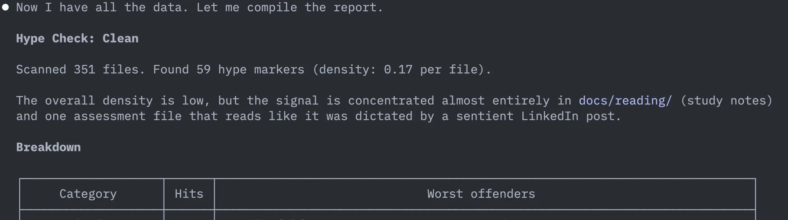

# hype-check

A [Claude Code skill](https://docs.anthropic.com/en/docs/claude-code/skills) that analyzes text-heavy projects for AI-generated writing patterns. Best suited for repos with documentation, specs, ADRs, design docs, or extensive code comments.

It greps for ~60 known phrasing tics across six categories — filler authority, corporate buzzwords, fake-casual tone, and the rest — then reports a hype density score with categorized examples.

Diagnostic only. No rewrites, no suggestions. Just a number and a hall of shame.



## Install

Copy the `hype-check/` directory into your Claude Code skills folder:

```
~/.claude/skills/hype-check/
```

Or clone this repo and symlink it:

```sh
git clone https://github.com/<you>/hype-check.git
ln -s "$(pwd)/hype-check" ~/.claude/skills/hype-check
```

No dependencies, no config.

## Usage

In Claude Code, run:

```
/hype-check
```

The skill auto-discovers what to scan in your project:

1. Documentation files (`.md`, `.txt`, `.rst`, `.adoc`)
2. Doc directories (`docs/`, `specs/`, `wiki/`)
3. Block comments and docstrings in source files (fallback)

If fewer than 3 files with prose are found, it exits early and tells you why.

## What it detects

| Category | Examples |
|---|---|
| **Dramatic framers** | "the key insight", "here's the thing", "let that sink in" |
| **Filler authority** | "crucially", "it's worth noting", "at the end of the day" |
| **Corporate buzzwords** | "leverage", "seamless", "ecosystem", "north star" |
| **AI reviewer voice** | "elegantly", "the right call", "not just X, but Y" |
| **Fake-casual** | "let's be honest", "real talk", "bear with me" |
| **Breathless structure** | "deep dive", "game-changer", "silver bullet", "rabbit hole" |

Legitimate technical usage is excluded — "robust to noise" in a signal processing doc won't get flagged.

## Hype levels

The report rates your project by hype density (matches per file scanned):

| Density | Level | Verdict |
|---|---|---|
| < 0.5 | **Clean** | Reads like a human wrote it |
| 0.5 – 1.5 | **Mild** | A few tells, mostly fine |
| 1.5 – 3.0 | **Sus** | AI ghostwriter energy |
| 3.0 – 5.0 | **Cooked** | Corporate keynote cosplay |
| > 5.0 | **Terminal** | The docs have achieved sentience |

## Requirements

- [Claude Code](https://docs.anthropic.com/en/docs/claude-code) with skills support
- A project with prose to scan — docs, specs, READMEs, design documents, or heavily commented source files

## License

MIT
